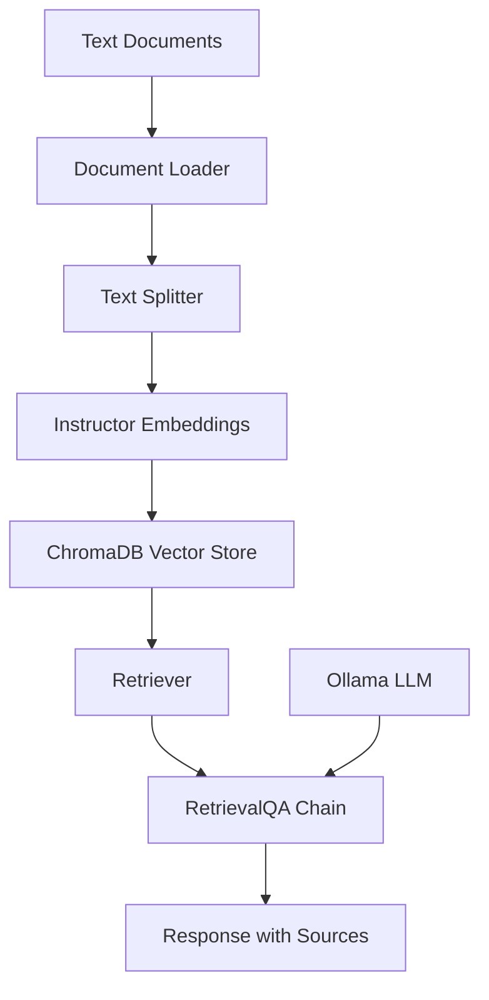

# 🤖 RAG System with LangChain and Ollama

## 📋 Table of Contents
- [Overview](#overview)
- [Features](#features)
- [Prerequisites](#prerequisites)
- [Installation](#installation)
- [System Architecture](#system-architecture)
- [Implementation Details](#implementation-details)
- [Usage Examples](#usage-examples)
- [Configuration](#configuration)
- [Troubleshooting](#troubleshooting)
- [Contributing](#contributing)

---

## 🎯 Overview

This project implements a **Retrieval-Augmented Generation (RAG)** system using LangChain, ChromaDB, and Ollama. The system enables intelligent question-answering by combining document retrieval with large language model generation capabilities.

### Key Components:
- **Document Loading**: Processes text files from a specified directory
- **Vector Storage**: Uses ChromaDB for persistent vector embeddings
- **Embeddings**: Leverages HuggingFace Instructor embeddings for semantic search
- **Language Model**: Integrates Ollama's Llama3.2 model for response generation
- **Question Answering**: Implements RetrievalQA chain with source citation

---

## ✨ Features

| Feature | Description |
|---------|-------------|
| 📄 **Multi-format Support** | Loads text files with UTF-8 encoding |
| 🔍 **Semantic Search** | Uses Instructor-XL embeddings for accurate retrieval |
| 💾 **Persistent Storage** | ChromaDB vector database with disk persistence |
| 🎯 **Configurable Retrieval** | Adjustable chunk size and retrieval parameters |
| 📚 **Source Attribution** | Tracks and cites source documents in responses |
| 🔄 **Chunking Strategy** | Recursive character text splitting with overlap |

---

## 🛠️ Prerequisites

### System Requirements
- Python 3.8+
- Ollama installed and running
- Sufficient disk space for vector database storage

### Python Dependencies
```bash
pip install langchain
pip install chromadb
pip install InstructorEmbedding
pip install sentence-transformers
pip install ollama
```

---

## 🚀 Installation

### 1. Clone and Setup
```bash
git clone <(https://github.com/AdnanOdeh04/AI-LangChain-Research.git)>
cd rag-system
python -m venv venv
source venv/bin/activate  # On Windows: venv\Scripts\activate
```

### 2. Install Dependencies
```bash
pip install -r requirements.txt
```

### 3. Setup Ollama
```bash
# Install Ollama (if not already installed)
curl https://ollama.ai/install.sh | sh

# Pull the Llama3.2 model
ollama pull llama3.2
```

### 4. Prepare Your Documents
Create an `articles` directory and place your text files:
```
project/
├── articles/
│   ├── cybersecurity_in_digital.txt
│   ├── Impact_of_climateChange.txt
│   └── other_documents.txt
└── QAM.ipynb
```

---

## 🏗️ System Architecture



### Data Flow:
1. **Document Ingestion**: Load text files from directory
2. **Text Chunking**: Split documents into manageable pieces
3. **Embedding Generation**: Convert text chunks to vector embeddings
4. **Vector Storage**: Store embeddings in ChromaDB
5. **Query Processing**: Retrieve relevant chunks for user queries
6. **Response Generation**: Generate answers using LLM with retrieved context

---

## 🔧 Implementation Details

### Document Loading Configuration
```python
loader = DirectoryLoader(
    "./articles",
    glob="*.txt",
    loader_cls=TextLoader,
    loader_kwargs={"encoding": "utf-8"}
)
```

### Text Splitting Strategy
```python
text_splitter = RecursiveCharacterTextSplitter(
    chunk_size=100,    # Small chunks for precise retrieval
    chunk_overlap=20   # Overlap to maintain context
)
```

### Embedding Model Setup
```python
embeddings = HuggingFaceInstructEmbeddings(
    model_name="hkunlp/instructor-xl",
    model_kwargs={"device": "cpu"}
)
```

### Vector Database Configuration
```python
vectordb = Chroma.from_documents(
    documents=texts,
    embedding=embeddings,
    persist_directory='db'  # Persistent storage
)
```

### Retrieval Configuration
```python
retriever = vectordb.as_retriever(
    search_kwargs={"k": 2}  # Return top 2 relevant chunks
)
```

---

## 📚 Usage Examples

### Basic Query Processing
```python
# Initialize the QA chain
qa_chain = RetrievalQA.from_chain_type(
    llm=llm,
    chain_type="stuff",
    retriever=retriever,
    return_source_documents=True
)

# Ask a question
query = "For Whom cybersecurity has emerged as a critical priority?"
response = qa_chain(query)
```

### Sample Queries and Responses

#### Example 1: Cybersecurity Query
**Query**: "For Whom cybersecurity has emerged as a critical priority?"
**Response**: "For individuals, businesses, and governments."
**Sources**: `articles/cybersecurity_in_digital.txt`

#### Example 2: Climate Change Query
**Query**: "What are the human activities that cause shift in temperature?"
**Response**: "Burning of fossil fuels (such as coal, oil, and gas) and deforestation are two examples mentioned in the context."
**Sources**: `articles/Impact_of_climateChange.txt`

---

## ⚙️ Configuration

### Adjustable Parameters

| Parameter | Default | Description |
|-----------|---------|-------------|
| `chunk_size` | 100 | Size of text chunks for processing |
| `chunk_overlap` | 20 | Overlap between consecutive chunks |
| `k` | 2 | Number of documents to retrieve |
| `search_type` | "similarity" | Vector search strategy |
| `model_name` | "hkunlp/instructor-xl" | Embedding model |
| `llm_model` | "llama3.2" | Language model for generation |

### Environment Variables
```bash
export OLLAMA_HOST=localhost:11434
export CHROMA_DB_PATH=./db
export DOCUMENTS_PATH=./articles
```

---

## 🔍 Troubleshooting

### Common Issues and Solutions

#### Issue: Model Loading Errors
```bash
# Solution: Ensure Ollama is running
ollama serve
ollama list  # Check available models
```

#### Issue: Embedding Model Warnings
```python
# This warning is normal and can be ignored:
# "No sentence-transformers model found with name hkunlp/instructor-xl"
```

#### Issue: ChromaDB Persistence Warnings
```python
# Modern ChromaDB versions auto-persist
# The warning about manual persistence is expected
```

#### Issue: Memory Usage
- **Problem**: High memory consumption with large documents
- **Solution**: Reduce `chunk_size` or increase `chunk_overlap`

---

## 📈 Performance Optimization

### Tips for Better Performance:
1. **Chunk Size**: Experiment with different chunk sizes (50-500 characters)
2. **Retrieval Count**: Adjust `k` value based on your use case
3. **Embedding Model**: Consider smaller models for faster processing
4. **Hardware**: Use GPU acceleration when available

### Monitoring:
```python
# Check vector database size
print(f"Number of documents: {vectordb._collection.count()}")

# Monitor retrieval performance
import time
start = time.time()
docs = retriever.get_relevant_documents(query)
print(f"Retrieval time: {time.time() - start:.2f}s")
```

---

## 🤝 Contributing

### Development Setup
1. Fork the repository
2. Create a feature branch
3. Make your changes
4. Add tests if applicable
5. Submit a pull request

### Code Style
- Follow PEP 8 guidelines
- Use meaningful variable names
- Add docstrings to functions
- Include type hints where appropriate


## 🙋‍♂️ Support

For questions or issues:
- 📧 Email: [adnanodeh2004@gmail.com](mailto:your-email@example.com)


---

## 📊 System Status

| Component | Status | Version |
|-----------|---------|---------|
| LangChain | ✅ Active | Latest |
| ChromaDB | ✅ Active | Latest |
| Ollama | ✅ Active | Latest |
| Instructor Embeddings | ✅ Active | 1.0.1 |

---

*Last updated: July 2025*
